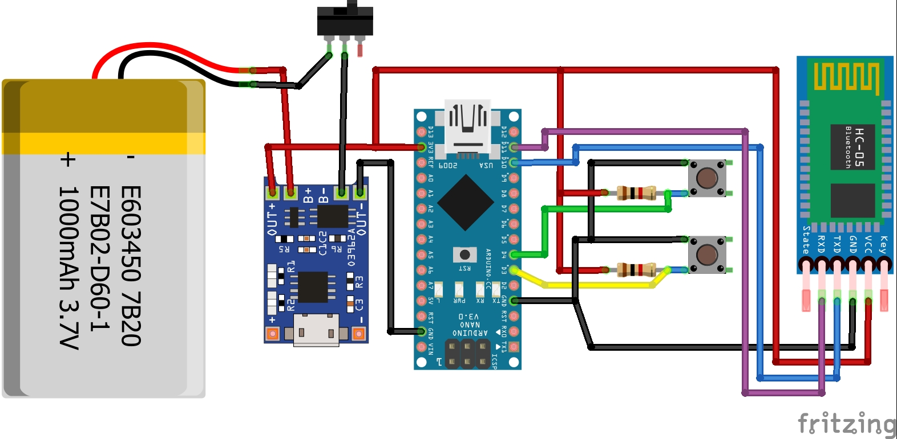

# Emergency Bracelet / Brazalete de Emergencia

Version: `1.1`

[English](#english) | [Espanol](#espanol)

---

## English

### Overview
This project is an emergency bracelet prototype built around three parts:

1. An Arduino sketch that sends Bluetooth signals through an HC-05 module.
2. A helper sketch to configure the HC-05 in AT mode.
3. An Android app that connects to the bracelet, receives emergency events, gets the phone location, and sends SMS alerts to emergency contacts.

When the Arduino sends the `S` signal, the Android app sends an SMS with a Google Maps location link. When it sends `D`, the app closes the Bluetooth session.

### Main Features
- Bluetooth communication with a paired HC-05 module selected from the app
- Emergency signal handling from Arduino to Android
- Automatic SMS alert with current location
- Emergency contact management from manual input or phone contacts
- Local Ecuador phone normalization: `09XXXXXXXX` -> `+5939XXXXXXX`
- Basic SMS anti-spam protection with a 60-second cooldown
- Multi-screen Android UI with sections for Home, Contacts, and Information

### Repository Structure
- `BrazaleteApp/`: Android application written in Kotlin
- `BrazaleteCpp/BrazaleteCpp.ino`: main Arduino firmware
- `configurar_hc-05/configurar_hc-05.ino`: HC-05 configuration sketch
- `prueba-botones/prueba-botones.ino`: simple button and LED test sketch
- `cotizacion_brazalete.xlsx`: cost estimate or project budget spreadsheet
- `Fritzing/Circuito.fzz`: editable Fritzing source file for the circuit
- `Fritzing/Circuito_image.jpg`: circuit image for the hardware documentation

### Circuit Image

### Hardware
- Arduino-compatible board
- HC-05 Bluetooth module
- Emergency trigger input connected to Arduino pin `3`
- Disconnect trigger input connected to Arduino pin `4`
- LED on pin `13`
- Voltage divider on the Arduino -> HC-05 RX line

### HC-05 Wiring Used by the Sketches
- HC-05 `TXD` -> Arduino pin `10`
- HC-05 `RXD` -> Arduino pin `11` through a voltage divider
- HC-05 `KEY/EN` -> Arduino pin `12` for AT-mode configuration sketch

### Software Requirements
- Arduino IDE with `SoftwareSerial`
- Android Studio
- JDK 11
- Android app settings currently use:
  - `minSdk = 21`
  - `targetSdk = 35`
  - `compileSdk = 36`

### How the System Works
1. The HC-05 is configured with the name `Brazalete-01`, PIN `2004`, slave mode, and `9600` baud.
2. The Android app shows the list of paired Bluetooth devices so the user can choose the bracelet manually.
3. The Arduino firmware monitors:
   - Pin `3`: sends `S`
   - Pin `4`: sends `D`
4. If the app receives `S`, it:
   - checks permissions
   - gets the device location
   - builds a Google Maps link
   - sends an SMS to all saved emergency contacts
5. If the app receives `D`, it disconnects from Bluetooth.

### Android Permissions Used
The app requests:
- Bluetooth / nearby devices
- Fine and coarse location
- SMS sending
- Contacts reading

These permissions are required for the app's current behavior.

### Setup

#### 1. Configure the HC-05
- Open `configurar_hc-05/configurar_hc-05.ino` in Arduino IDE.
- Put the HC-05 into AT mode using `KEY/EN`.
- Upload the sketch.
- Open Serial Monitor and verify the AT responses.
- This sketch configures:
  - name: `Brazalete-01`
  - PIN: `2004`
  - baud rate: `9600`
  - role: slave

#### 2. Upload the Main Arduino Firmware
- Open `BrazaleteCpp/BrazaleteCpp.ino`.
- Upload it to the Arduino board.
- The firmware will send:
  - `S` when pin `3` goes `HIGH`
  - `D` when pin `4` goes `HIGH`

#### 3. Build and Install the Android App
- Open `BrazaleteApp/` in Android Studio.
- Sync Gradle dependencies.
- Build and install the app on an Android phone with Bluetooth, SMS, and location support.

#### 4. Pair the Phone with the HC-05
- Pair the module from Android Bluetooth settings.
- Use PIN `2004` if requested.
- The module name must be `Brazalete-01`.

#### 5. Use the App
- Open the app.
- Grant all requested permissions.
- On the `Contactos` screen, add one or more emergency contacts.
- Return to `Inicio` and tap `Conectar brazalete`.
- Trigger pin `3` on the Arduino to send an emergency alert.

### Notes and Limitations
- The app depends on classic Bluetooth and a previously paired HC-05.
- SMS delivery depends on the phone, SIM card, carrier, permissions, and Android restrictions.
- Location availability depends on GPS/network providers being enabled.
- The emergency message is sent only if at least one contact exists.
- Repeated alerts are throttled to one SMS batch every 60 seconds.

### Safety Notice
This is a prototype. It should not be treated as a certified medical, personal security, or life-critical system without additional hardware validation, field testing, power-failure handling, and operational review.

[Back to top](#emergency-bracelet--brazalete-de-emergencia)

---

## Espanol

### Descripcion General
Este proyecto es un prototipo de brazalete de emergencia compuesto por tres partes:

1. Un programa de Arduino que envia senales Bluetooth mediante un modulo HC-05.
2. Un programa auxiliar para configurar el HC-05 en modo AT.
3. Una aplicacion Android que se conecta al brazalete, recibe eventos de emergencia, obtiene la ubicacion del telefono y envia SMS a contactos de emergencia.

Cuando el Arduino envia la senal `S`, la aplicacion Android manda un SMS con un enlace de Google Maps. Cuando envia `D`, la aplicacion cierra la conexion Bluetooth.

### Caracteristicas Principales
- Comunicacion Bluetooth con un HC-05 emparejado y seleccionado desde la app
- Recepcion de senales de emergencia desde Arduino
- Envio automatico de SMS con ubicacion actual
- Gestion de contactos de emergencia por ingreso manual o desde contactos del telefono
- Normalizacion basica de numeros de Ecuador: `09XXXXXXXX` -> `+5939XXXXXXX`
- Proteccion anti-spam de SMS con espera minima de 60 segundos
- Interfaz Android con navegacion por pantallas de Inicio, Contactos e Informacion

### Estructura del Repositorio
- `BrazaleteApp/`: aplicacion Android escrita en Kotlin
- `BrazaleteCpp/BrazaleteCpp.ino`: firmware principal de Arduino
- `configurar_hc-05/configurar_hc-05.ino`: programa para configurar el HC-05
- `prueba-botones/prueba-botones.ino`: programa simple para probar botones y LED
- `cotizacion_brazalete.xlsx`: hoja de costos o presupuesto del proyecto
- `Fritzing/Circuito.fzz`: archivo editable de Fritzing del circuito
- `Fritzing/Circuito_image.jpg`: imagen del circuito para la documentacion del hardware

### Imagen del Circuito

### Hardware
- Placa compatible con Arduino
- Modulo Bluetooth HC-05
- Entrada de alerta conectada al pin `3` del Arduino
- Entrada de desconexion conectada al pin `4` del Arduino
- LED en el pin `13`
- Divisor de voltaje en la linea Arduino -> RX del HC-05

### Conexion del HC-05 Usada en los Programas
- `TXD` del HC-05 -> pin `10` del Arduino
- `RXD` del HC-05 -> pin `11` del Arduino mediante divisor de voltaje
- `KEY/EN` del HC-05 -> pin `12` del Arduino para el programa de configuracion AT

### Requisitos de Software
- Arduino IDE con `SoftwareSerial`
- Android Studio
- JDK 11
- La app Android usa actualmente:
  - `minSdk = 21`
  - `targetSdk = 35`
  - `compileSdk = 36`

### Como Funciona el Sistema
1. El HC-05 se configura con el nombre `Brazalete-01`, PIN `2004`, modo esclavo y `9600` baudios.
2. La app Android muestra los dispositivos Bluetooth ya emparejados para que el usuario seleccione manualmente el brazalete.
3. El firmware de Arduino monitorea:
   - Pin `3`: envia `S`
   - Pin `4`: envia `D`
4. Si la app recibe `S`, hace lo siguiente:
   - verifica permisos
   - obtiene la ubicacion del dispositivo
   - crea un enlace de Google Maps
   - envia un SMS a todos los contactos de emergencia guardados
5. Si la app recibe `D`, se desconecta del Bluetooth.

### Permisos Android Utilizados
La aplicacion solicita:
- Bluetooth / dispositivos cercanos
- Ubicacion precisa y aproximada
- Envio de SMS
- Lectura de contactos

Estos permisos son necesarios para el comportamiento actual de la app.

### Configuracion

#### 1. Configurar el HC-05
- Abre `configurar_hc-05/configurar_hc-05.ino` en Arduino IDE.
- Coloca el HC-05 en modo AT usando `KEY/EN`.
- Carga el programa.
- Abre el Monitor Serial y verifica las respuestas AT.
- Este programa configura:
  - nombre: `Brazalete-01`
  - PIN: `2004`
  - velocidad: `9600`
  - rol: esclavo

#### 2. Cargar el Firmware Principal de Arduino
- Abre `BrazaleteCpp/BrazaleteCpp.ino`.
- Cargalo en la placa Arduino.
- El firmware enviara:
  - `S` cuando el pin `3` pase a `HIGH`
  - `D` cuando el pin `4` pase a `HIGH`

#### 3. Compilar e Instalar la App Android
- Abre `BrazaleteApp/` en Android Studio.
- Sincroniza las dependencias de Gradle.
- Compila e instala la app en un telefono Android con Bluetooth, SMS y ubicacion disponibles.

#### 4. Emparejar el Telefono con el HC-05
- Empareja el modulo desde los ajustes Bluetooth de Android.
- Usa el PIN `2004` si el sistema lo solicita.
- El nombre del modulo debe ser `Brazalete-01`.

#### 5. Usar la App
- Abre la aplicacion.
- Concede todos los permisos solicitados.
- En la pantalla `Contactos`, agrega uno o mas contactos de emergencia.
- Vuelve a `Inicio` y pulsa `Conectar brazalete`.
- Activa el pin `3` en el Arduino para enviar una alerta de emergencia.

### Notas y Limitaciones
- La app depende de Bluetooth clasico y de un HC-05 previamente emparejado.
- El envio de SMS depende del telefono, la SIM, la operadora, los permisos y las restricciones de Android.
- La ubicacion depende de que GPS o red esten habilitados.
- El mensaje de emergencia solo se envia si existe al menos un contacto guardado.
- Las alertas repetidas se limitan a un lote de SMS cada 60 segundos.

### Aviso de Seguridad
Este proyecto es un prototipo. No debe considerarse un sistema medico, de seguridad personal o de uso critico sin validacion adicional de hardware, pruebas en campo, manejo de fallos de energia y revision operativa.

[Volver arriba](#emergency-bracelet--brazalete-de-emergencia)
